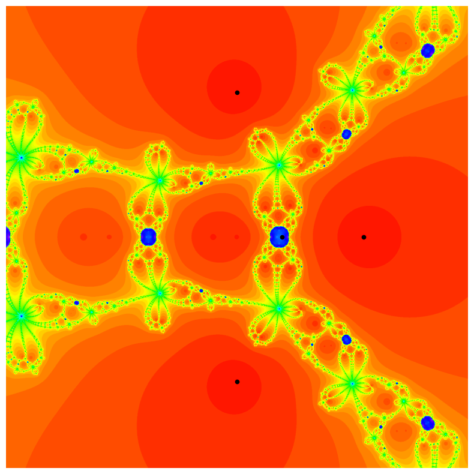

## Introduction

The Damped Traub's Method is a widely-used numerical algorithm for finding roots of complex polynomials. Understanding the behavior of this method in the complex plane is crucial for analyzing its convergence properties. This repository provides tools to visualize the basins of attraction, aiding in the comprehension of the method's behavior. The Damped Traub's Method family encompasses a range of algorithms utilized for root finding of complex polynomials. Within this family, $\delta=0$ corresponds to the well-known Newton Method, while $\delta=1$ corresponds to the Traub Method.

## Example Pictures

  
  
  

## Features
- Implementation in Python
- Visualization of basins of attraction in the complex plane
- Two options for plotting basins of attraction: with different colors or with a unique palette of colors

## File Structure
- **utils.py**: Contains the definitions of the necessary functions.
- **colored-newton.ipynb**: Jupyter notebook for plotting basins of attraction with different colors.
- **damped-traub.ipynb**: Jupyter notebook for plotting basins of attraction with a unique palette of colors.
- **parameter-plane.ipynb**: Jupyter notebook for visualizing the parameter plane of a Blaschke product.
- **numerical_evidences/**: Folder containing Python implementations to demonstrate numerical evidences, particularly focusing on proving that Damped Traub's Method basins of attractions are unbounded and simple connected sets.
  
## Usage
To utilize this repository, simply clone it to your local machine and execute the provided Jupyter notebooks. Make sure to have the necessary dependencies installed.

## License
This project is licensed under the MIT License - see the [MIT License](LICENSE) file for details.

## Acknowledgments
Special thanks to [Dr. Xavier Jarque i Ribera](https://mat.ub.edu/departament/professors/jarque-i-ribera-xavier/) for their contributions and inspirations.

## Contact
For any inquiries or suggestions, please feel free to reach out to [rosadodav4@gmail.com](mailto:rosadodav4@gmail.com).
